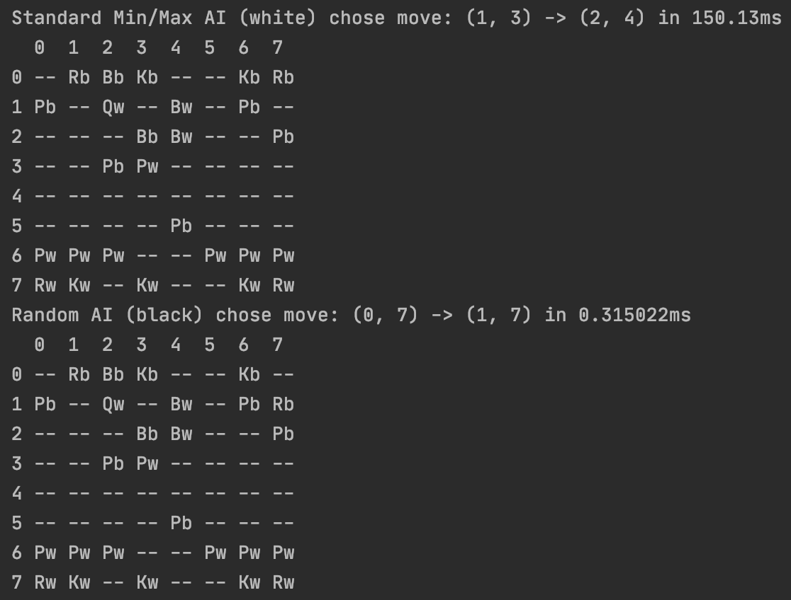

# Chess Plus Plus (In Progress)
Chess Plus Plus is a chess-based game built from scratch in C++. One of the primary goals of this project is to make 
use of object-oriented inheritance principles to make future expansion not just possible, but easy. All it should take
is inheriting from a base class, defining its custom behavior, and registering it.
This project is currently in progress, and as such, some features are not quite complete yet. 

---
Usage
===
By default, the program will run a game between a minimax AI and a random AI. 
In order to change this two command line arguments may be added to specify each player's type out of the following selection: human, minimax, itrdeepening, random.

Command line arguments (one or both are optional): \[player1Type] \[player2Type]

AI Algorithms
===
Minimax with Alpha-Beta Pruning - (MinMaxAI)
---
An AI that chooses its move by simulating moves and choosing a move whose branch maximized its own score and minimized its opponents score.
Score calculations are made using the following heuristic evaluation function:\
&nbsp;&nbsp;ADD the current score as defined by a game state for that player\
&nbsp;&nbsp;ADD the weighted points received from capturing opponents pieces\
    &nbsp;&nbsp;&nbsp;&nbsp;&nbsp;&nbsp; i.e. a king might have a capture score of 1,000 points making it much more important to capture vs a pawn which may have a score of 100 for example\
&nbsp;&nbsp;SUBTRACT the opponent's score calculated in the same manner

In order to reduce the amount of time spent simulating moves, a branch may be marked as insignificant to explore compared 
to the branch scores of previously explored branches, and will thus be skipped entirely.

IterativeDeepening - (IterativeDeepeningAI)
---
An AI similar to the Minimax AI but operates under a given time limit restriction. 
The AI continually explores game tree simulations at a greater and greater depth until it runs out of time and reverts to the best move it was able to find before it ran out of time.

Random - (RandomAI)
---
An AI that chooses its move randomly from a selection of all possible moves that can currently be made.

